# Excel-Outlook-Calendar-Sync

Erstelle Outlook Termine automatisch aus einer Excel Liste. Ideal zum Planen von mehreren komplexen Terminen, z.B. bei Veranstaltungsreihen, oder zum automatischen Erstellen vieler Termine.
In dieser Anleitung wird den automatisch erstellten Terminen die Kategorie "automatisch erstellt" zugewiesen und die Automatisierung betrifft auch nur diese Termine. Dadurch kann der Outlook Kalendar ansonsten normal genutzt werden.
Die Excel Tabelle fungiert als SPOT (Single Point of Truth), Änderungen der Termine sollten hier vorgenommen werden, da sie sonst überschrieben werden.

## Übersicht
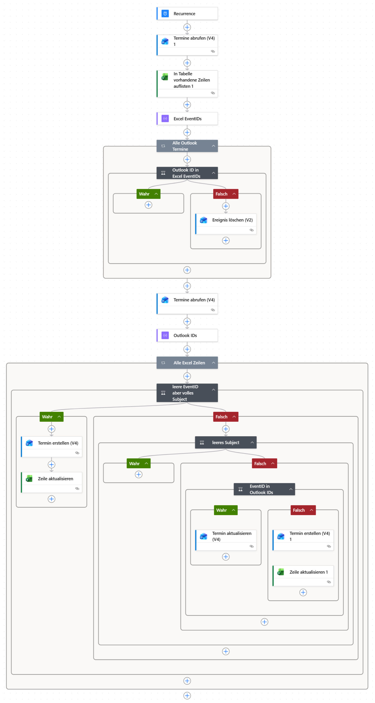

## Anleitung

### Schritt 0
Erstelle einen neuen Flow auf https://make.powerautomate.com
- Geplanter Cloud-Flow (alle 2–5 Minuten)

Durch **+** werden Aktionen hinzugefügt.
Parameter können feste Werte, dynamische Inhalte oder Ausdrücke (Formeln) sein. Wenn ein Textfeld ausgewählt ist, erscheinen die zwei letztgenannten Optionen. Durch sie werden Daten weitergegeben. Dynamische Inhalte sind auch Ausdrücke, zum Beispiel: Dynamischer Inhalt > Termine abrufen > body/value entspricht dem Ausdruck `outputs('Termine_abrufen_(V4)')?['body/value']`.

### Legende
- **Aktion** steht in der Überschrift. Wurde die Aktion umbenannt, steht der eigene Name kursiv in Klammern dahinter, z. B. **Bedingung** (*Outlook ID in Excel EventIDs*).
- **Pfad** zeigt, in welcher Schleife bzw. welchem Verzweigungszweig sich die Aktion befindet. Steht die Aktion auf der obersten Ebene des Flows, entfällt die Pfad-Zeile.
- *(Typ)* steht unter der Überschrift / dem Pfad. Aktionen sind nach Typen sortiert ( *Office 365 Outlook*, *Datenvorgang*, *Steuerung* etc).

### 1. Termine abrufen (V4)
*(Office 365 Outlook)*

- Kalender-ID: `Kalender`
- Erweiterte Parameter > Abfrage filtern auswählen
- Abfrage filtern: `categories/any(c:c eq 'automatisch erstellt')` (kann durch eine beliebige Kategorie ersetzt werden)

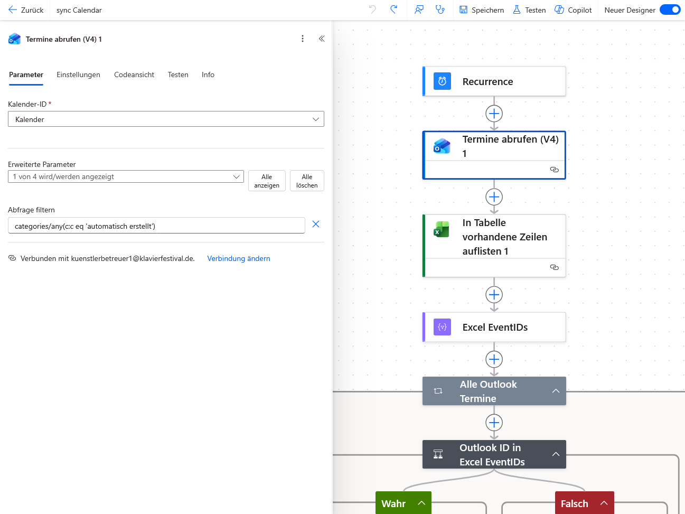

### 2. In Tabelle vorhandene Zeilen auflisten
*(Excel Online (Business))*

- Excel-Datei und Tabelle festlegen (Daten _müssen_ in einer Tabelle gespeichert sein)
- Optional: Erweiterte Parameter > DateTime-Format auswählen (z. B. ISO 8601)

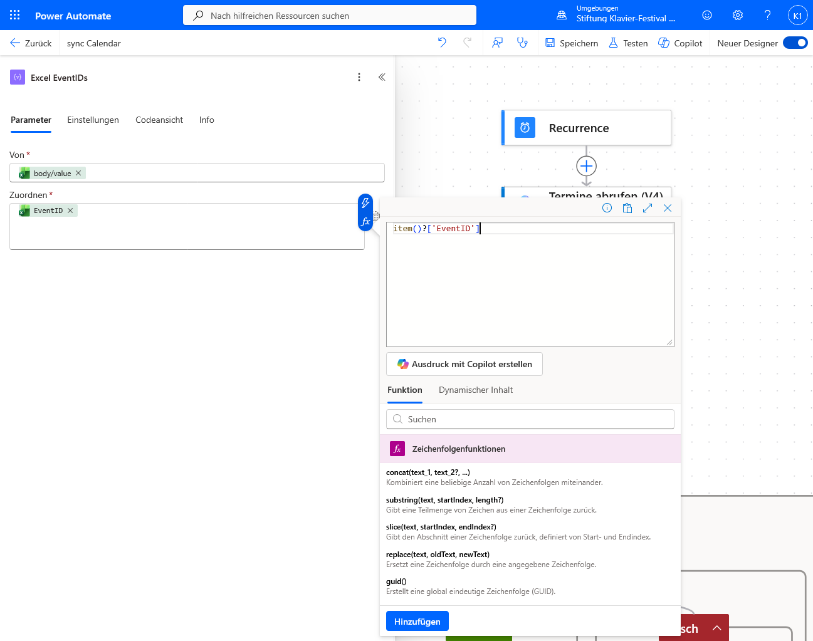

### 3. Auswählen (*Excel EventIDs*)
*(Datenvorgang)*

- Von: `outputs('In_Tabelle_vorhandene_Zeilen_auflisten')?['body/value']` (Ausgabe von Schritt 2)
- Bei Zuordnen zum Text-Modus wechseln
- Zuordnen: `item()?['EventID']`

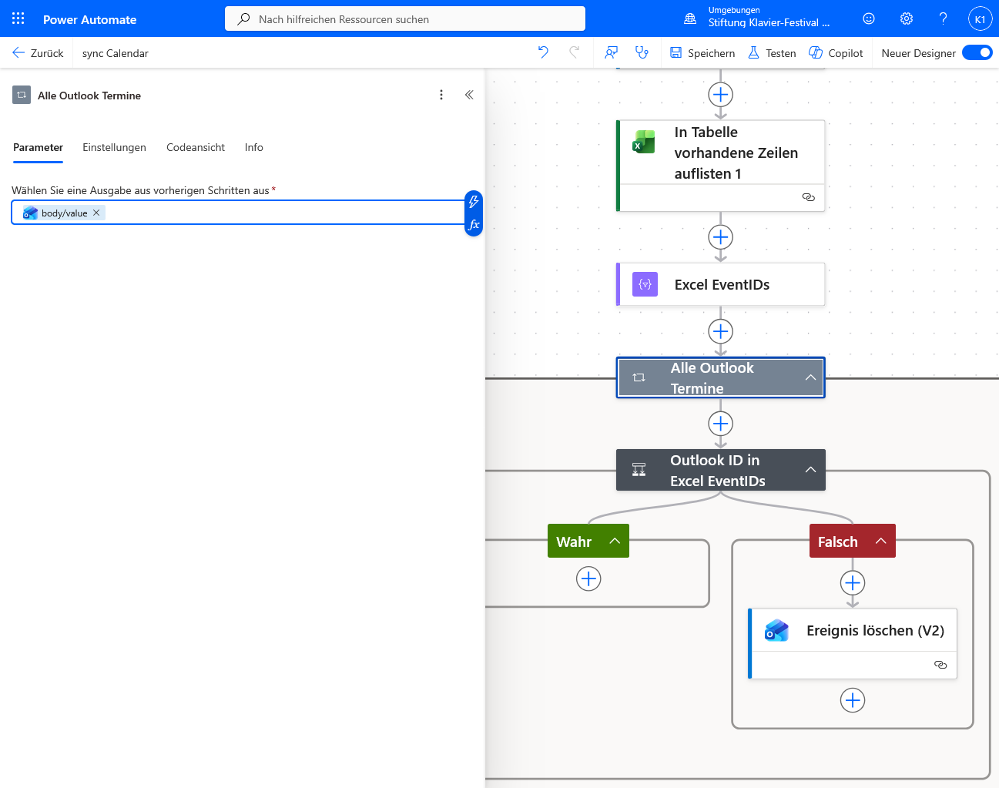

### 4. Auf alle anwenden (*Alle Outlook Termine*)
*(Steuerung)*

- Ausgabe: `outputs('Termine_abrufen_(V4)')?['body/value']` (Ausgabe von Schritt 1)

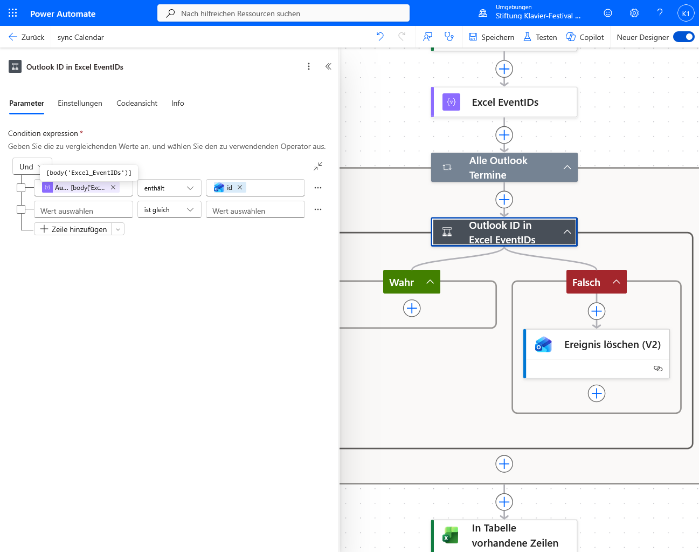

### 5. Bedingung (*Outlook ID in Excel EventIDs*)
**Pfad:** Alle Outlook Termine

- Und:
  - `[body('Excel_Event_IDs')]` enthält `items('Alle_Outlook_Termine')?['id']` (ID aus dem jeweiligen Element der Schleife aus Schritt 4)

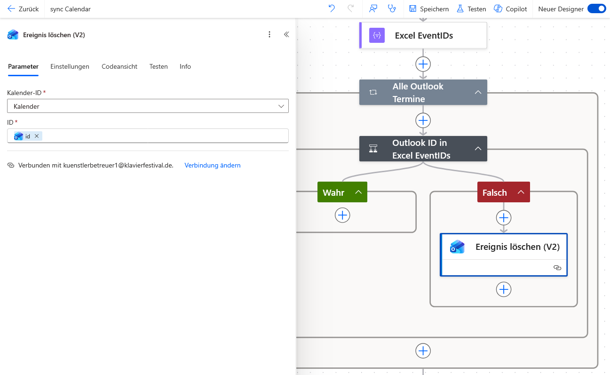

### 6. Ereignis löschen (V2)
**Pfad:** Alle Outlook Termine › Outlook ID in Excel EventIDs › Falsch

*(Office 365 Outlook)*

- Kalender-ID: `Kalender`
- ID: `items('Alle_Outlook_Termine')?['id']`

### 7. Termine abrufen (V4) (*Termine abrufen (V4) 1*)
*(Office 365 Outlook)*

- Kalender-ID: `Kalender`
- Erweiterte Parameter > Abfrage filtern: `categories/any(c:c eq 'automatisch erstellt')` (kann durch eine beliebige Kategorie ersetzt werden)

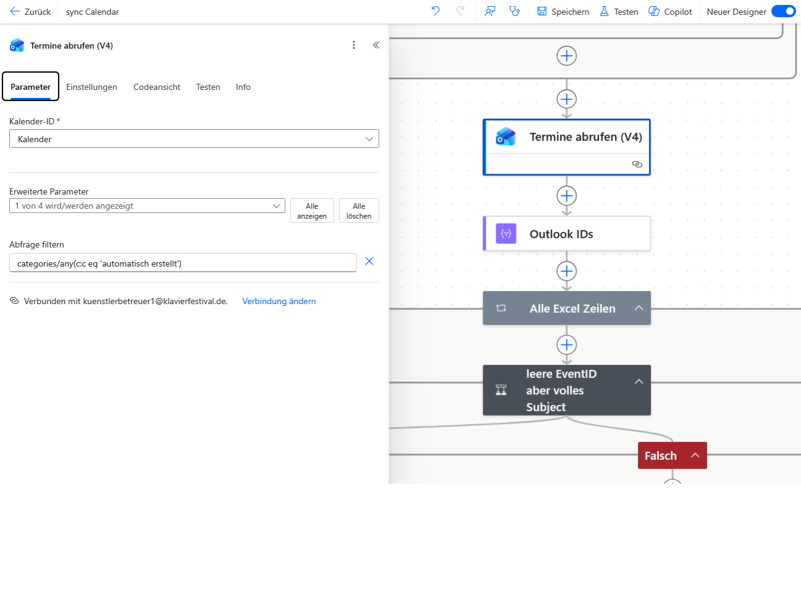

### 8. Auswählen (*Outlook IDs*)
*(Datenvorgang)*

- Von: `outputs('Termine_abrufen_(V4)_1')?['body/value']` (Ausgabe von Schritt 7)
- Bei Zuordnen zum Text-Modus wechseln
- Zuordnen: `item()?['ID']`

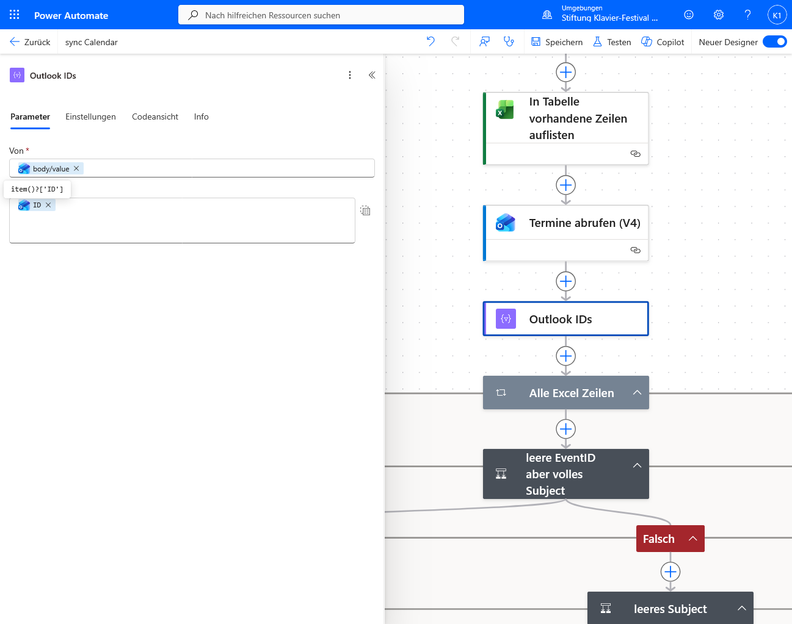

### 9. Auf alle anwenden (*Alle Excel Zeilen*)
*(Steuerung)*

- Ausgabe: `outputs('In_Tabelle_vorhandene_Zeilen_auflisten')?['body/value']` (Ausgabe von Schritt 2)

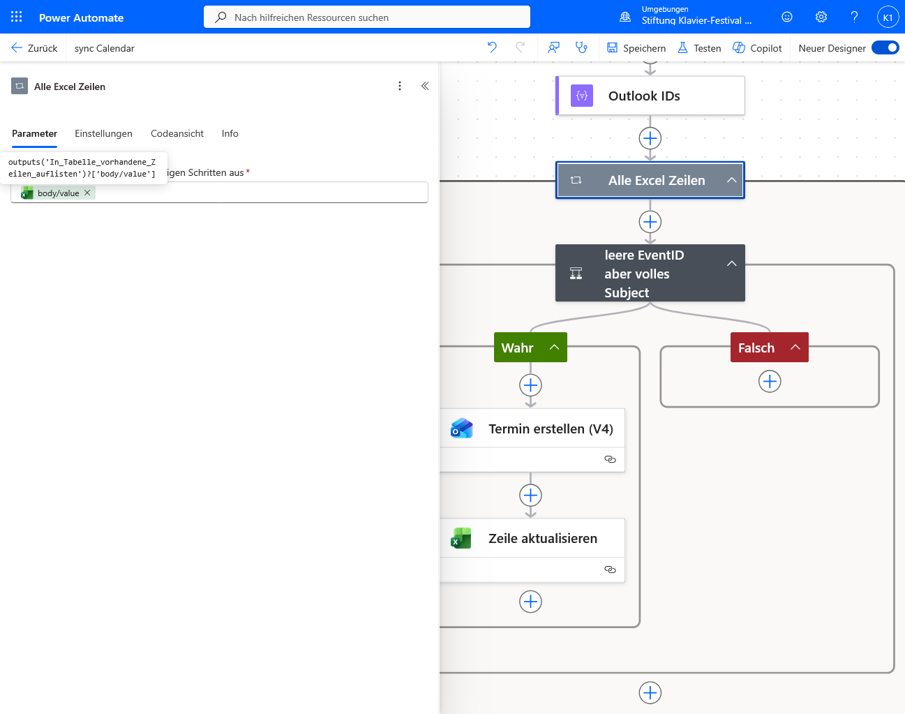

### 10. Bedingung (*leere EventID aber volles Subject*)
**Pfad:** Alle Excel Zeilen

- Und:
  - `empty(items('Alle_Excel_Zeilen')?['EventID'])` ist gleich `true` (EventID aus dem jeweiligen Element der Schleife aus Schritt 9)
  - `empty(items('Alle_Excel_Zeilen')?['Subject'])` ist gleich `false` (Subject aus dem jeweiligen Element der Schleife aus Schritt 9)

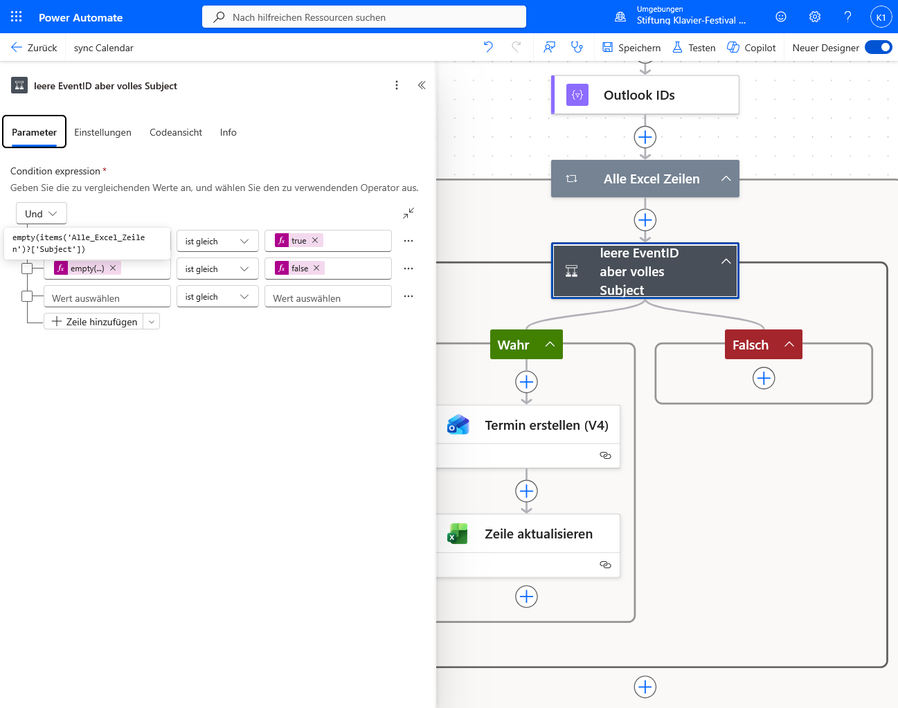

### 11. Termin erstellen (V4)
**Pfad:** Alle Excel Zeilen › leere EventID aber volles Subject › Wahr

*(Office 365 Outlook)*

- Kalender-ID: `Kalender`
- Betreff, Startzeit, Endzeit jeweils einer Spalte aus `items('Alle_Excel_Zeilen')` zuweisen (Element der Schleife aus Schritt 9), z. B. `items('Alle_Excel_Zeilen')?['StartDateTime']`
- Zeitzone auswählen
- Erweiterte Parameter > Kategorien > Kategorien Item - 1: `automatisch erstellt` (die gewählte Kategorie aus Schritt 1)
- Optionale Parameter (aus Erweiterte Parameter):
  - Erforderliche Teilnehmer
  - Text (steht später in der Beschreibung des Termins; kann aus einer eigenen Spalte der Excel-Tabelle stammen oder aus mehreren dynamischen Inhalten zusammengesetzt werden, z. B. Ort, relevante Links etc.)

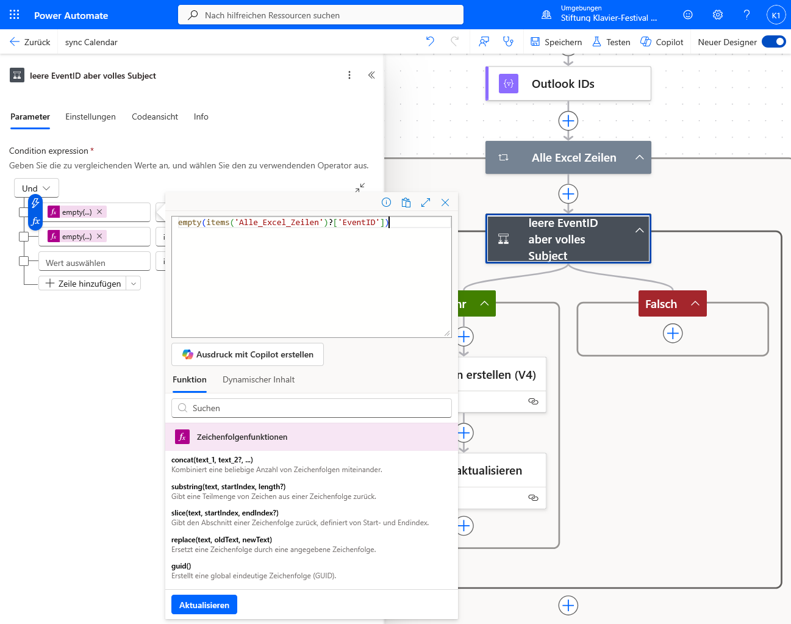

### 12. Zeile aktualisieren
**Pfad:** Alle Excel Zeilen › leere EventID aber volles Subject › Wahr

*(Excel Online (Business))*

- Excel-Datei und Tabelle festlegen (Daten _müssen_ in einer Tabelle gespeichert sein)
- Schlüsselspalte: Index
- Schlüsselwert: `items('Alle_Excel_Zeilen')?['Index']`
- Erweiterte Parameter > EventID: `outputs('Termin_erstellen_(V4)')?['body/id']`

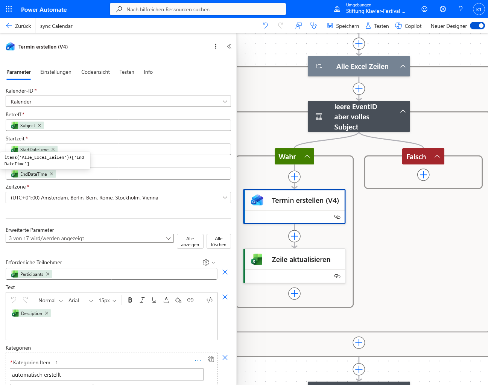

### 13. Bedingung (*leeres Subject*)
**Pfad:** Alle Excel Zeilen › leere EventID aber volles Subject › Falsch

*(Excel Online (Business))*

- Und:
  - `empty(items('Alle_Excel_Zeilen')?['Subject'])` ist gleich `true`

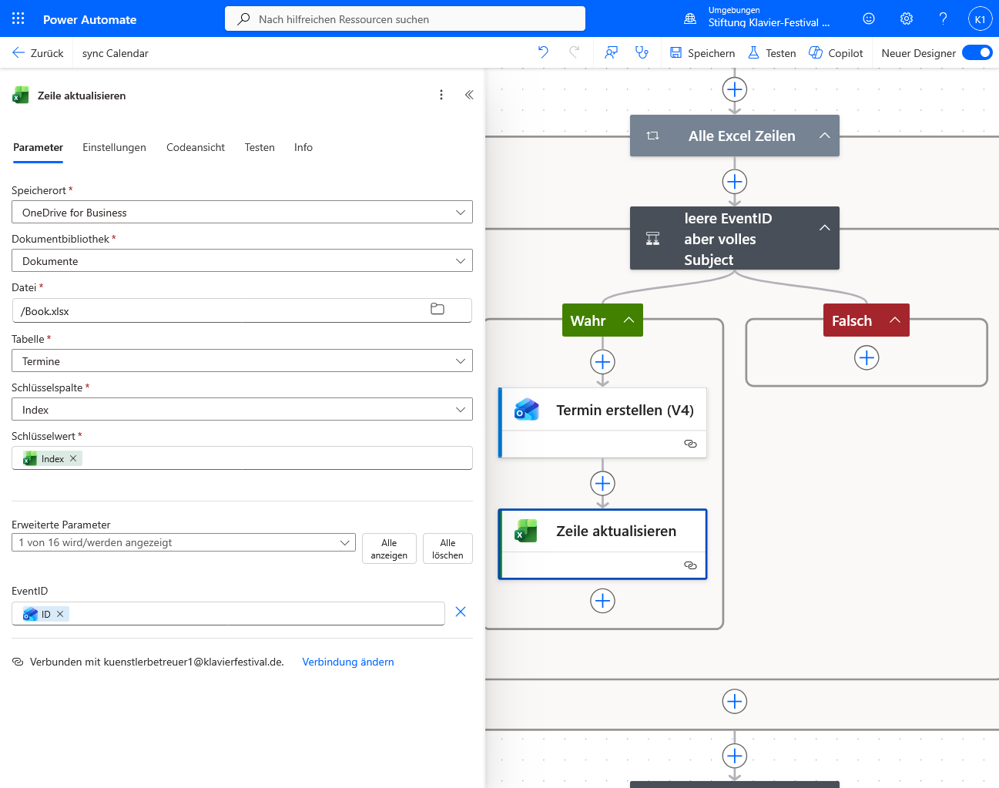

### 14. Bedingung (*EventID in Outlook IDs*)
**Pfad:** Alle Excel Zeilen › leere EventID aber volles Subject › Falsch › leeres Subject › Falsch

*(Excel Online (Business))*

- Und:
  - `body('Outlook_IDs')` enthält `items('Alle_Excel_Zeilen')?['EventID']`

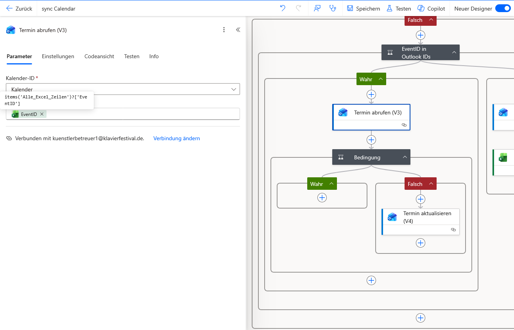

### 15. Termin aktualisieren (V4)
**Pfad:** Alle Excel Zeilen › leere EventID aber volles Subject › Falsch › leeres Subject › Falsch › EventID in Outlook IDs › Wahr

*(Office 365 Outlook)*

- Kalender-ID: `Kalender`
- ID, Betreff, Startzeit, Endzeit jeweils einer Spalte aus `items('Alle_Excel_Zeilen')` zuweisen (wie in Schritt 11)
- Zeitzone auswählen
- Erweiterte Parameter > Kategorien > Kategorien Item - 1: `automatisch erstellt`
- Optionale Parameter (aus Erweiterte Parameter): siehe Schritt 11

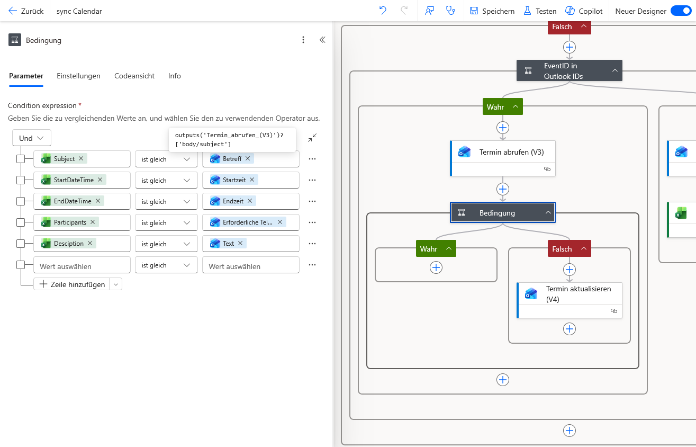

### 16. Termin erstellen (V4) (*Termin erstellen (V4) 1*)
**Pfad:** Alle Excel Zeilen › leere EventID aber volles Subject › Falsch › leeres Subject › Falsch › EventID in Outlook IDs › Falsch

*(Office 365 Outlook)*

*(wie in Schritt 11 & 15)*

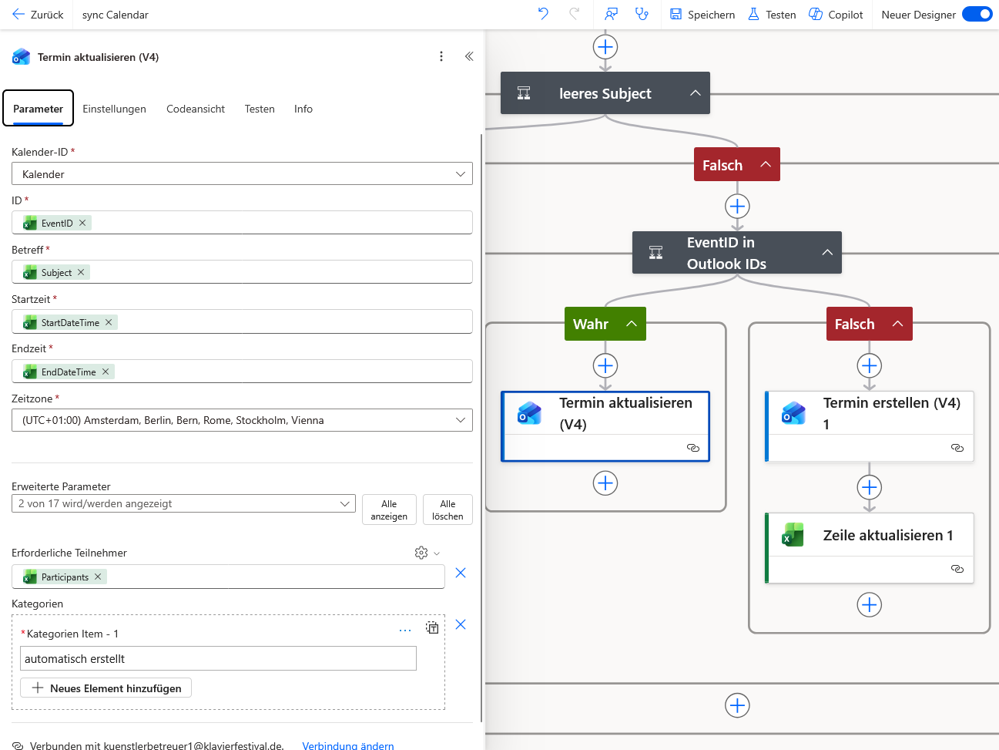

### 17. Zeile aktualisieren (*Zeile aktualisieren 1*)
**Pfad:** Alle Excel Zeilen › leere EventID aber volles Subject › Falsch › leeres Subject › Falsch › EventID in Outlook IDs › Falsch

*(Excel Online (Business))*

- Excel-Datei und Tabelle festlegen (Daten _müssen_ in einer Tabelle gespeichert sein)
- Schlüsselspalte: Index
- Schlüsselwert: `items('Alle_Excel_Zeilen')?['Index']`
- Erweiterte Parameter > EventID: `outputs('Termin_erstellen_(V4)')?['body/id']`

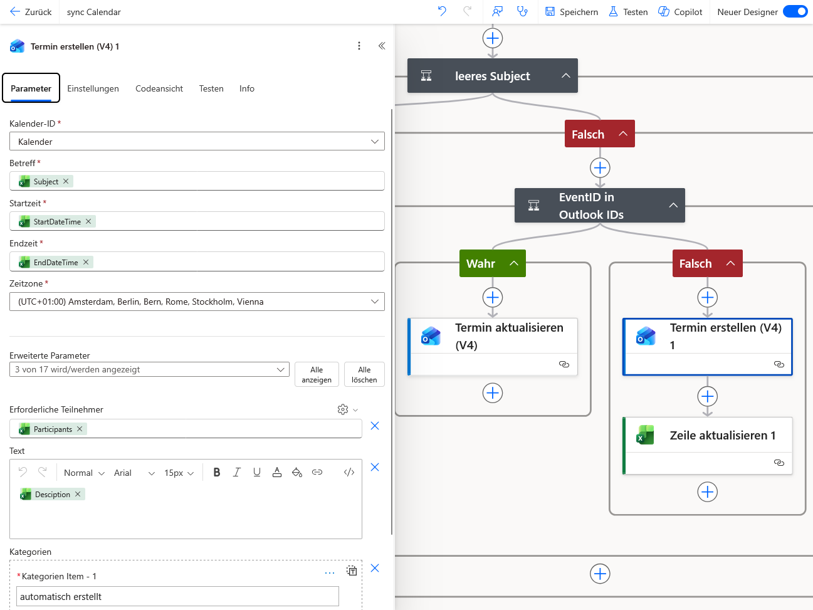
