**[German version / Deutsche Version](LIESMICH.md)**

# Excel-Outlook-Calendar-Sync
 
Automatically synchronize Outlook events with an Excel table. Ideal for planning multiple complex events, e.g. for event series, or for automatically creating many events. Can be used as an alternative to the calendar features of Notion, Airtable, ClickUp, monday.com, etc.

In this guide, the automatically created events are assigned the category "automatically created", and the automation only affects these events. This way, the Outlook calendar can otherwise be used normally.
The Excel table acts as the SPOT (Single Point of Truth). Changes to events should be made here, otherwise they will be overwritten.

> **Note:** The images show the German version, but the text contains all necessary information by itself. If anything is unclear, feel free to reach out to me.

 
## Overview
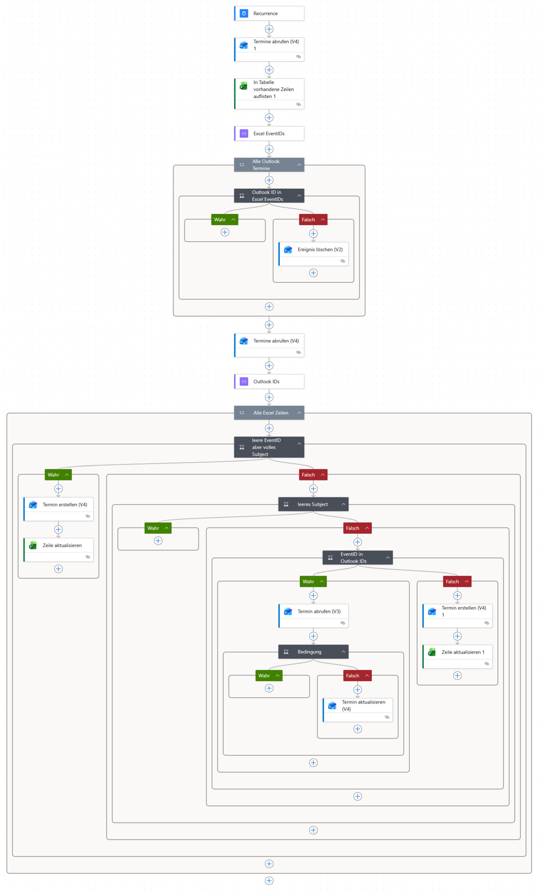

## Instructions

### Preparations
Create an Excel sheet with a _Table_ that has at least the following columns:
`Subject;	StartDateTime;	EndDateTime;	Description;	Participants;	EventID;	Index`
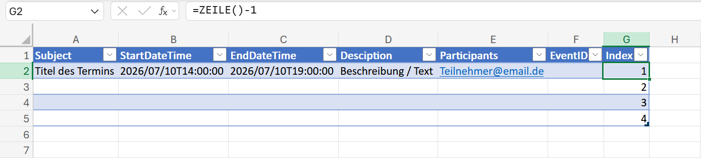

Create a new flow (Scheduled cloud flow (every 2–5 minutes)) at https://make.powerautomate.com

Actions are added using **+**.
Parameters can be fixed values, dynamic content, or expressions (formulas). When a text field is selected, the latter two options appear. These are used to pass data along. Dynamic content is also based on expressions, for example: Dynamic content > Get events > body/value corresponds to the expression `outputs('Get_events_(V4)')?['body/value']`. 

### Legend
- **Action** is shown in the heading. If the action has been renamed, its custom name appears in italics in parentheses afterward, e.g. **Condition** (*Outlook ID in Excel EventIDs*).
- **Path** shows which loop or branch the action is located in. If the action is at the top level of the flow, the Path line is omitted.
- *(Type)* appears below the heading / the Path. Actions are grouped by type (*Office 365 Outlook*, *Data Operation*, *Control*, etc.).

### 1. Get events (V4)
*(Office 365 Outlook)*

- Calendar ID: `Calendar`
- Under Advanced options, select Filter Query
- Filter Query: `categories/any(c:c eq 'automatically created')` (can be replaced with any category)

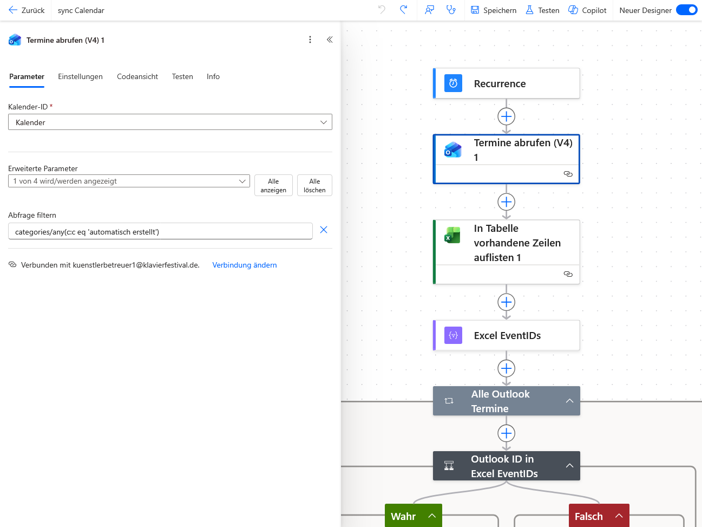

### 2. List rows present in a table
*(Excel Online (Business))*

- Specify the Excel file and table (data _must_ be stored in a table)
- Optional: Advanced options > select DateTime Format (e.g. ISO 8601)

### 3. Select (*Excel EventIDs*)
*(Data Operation)*

- From: `outputs('List_rows_present_in_a_table')?['body/value']` (output of step 2)
- Switch Map to text mode
- Map: `item()?['EventID']`

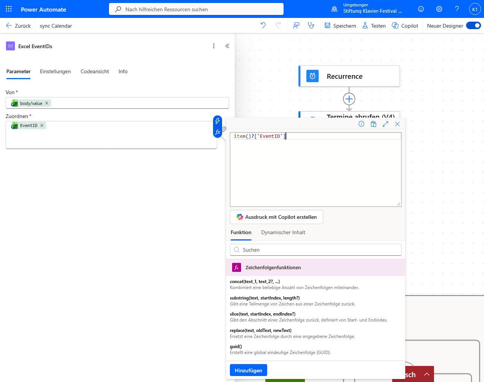

### 4. Apply to each (*All Outlook events*)
*(Control)*

- Output: `outputs('Get_events_(V4)')?['body/value']` (output of step 1)

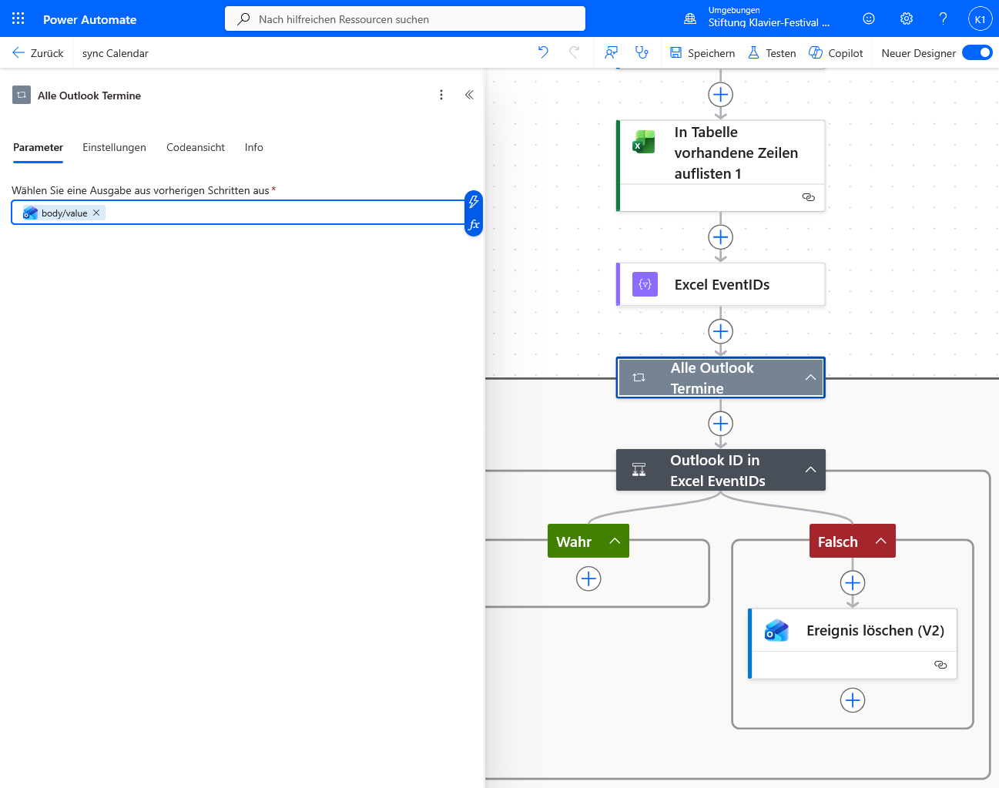

### 5. Condition (*Outlook ID in Excel EventIDs*)
**Path:** All Outlook events

- And:
  - `[body('Excel_Event_IDs')]` contains `items('All_Outlook_events')?['id']` (ID from the current item of the loop from step 4)

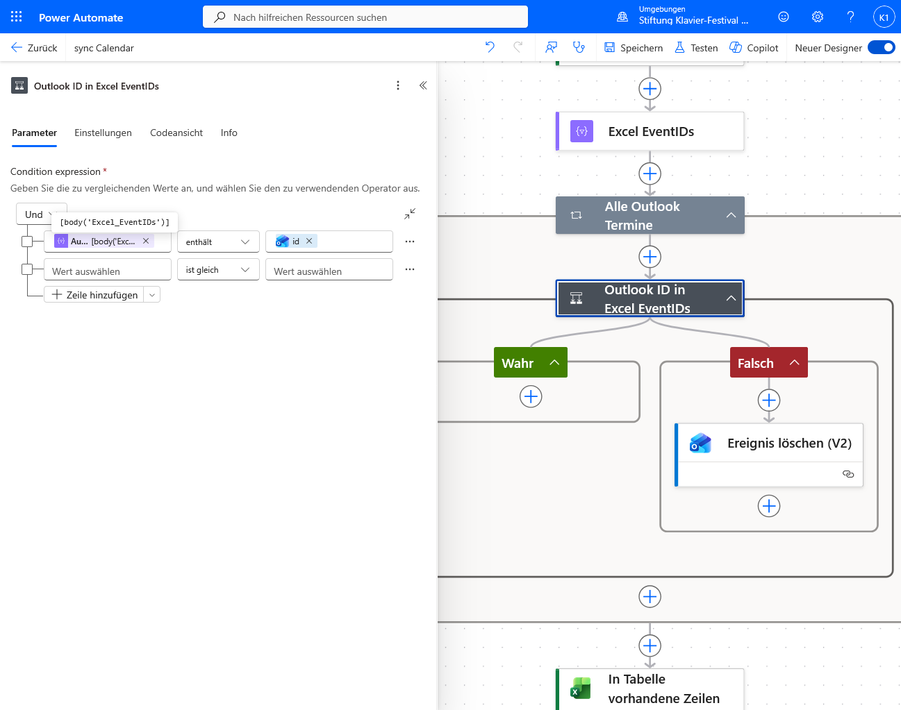

### 6. Delete event (V2)
**Path:** All Outlook events › Outlook ID in Excel EventIDs › False

*(Office 365 Outlook)*

- Calendar ID: `Calendar`
- ID: `items('All_Outlook_events')?['id']`

### 7. Get events (V4) (*Get events (V4) 1*)
*(Office 365 Outlook)*

- Calendar ID: `Calendar`
- Advanced options > Filter Query: `categories/any(c:c eq 'automatically created')` (can be replaced with any category)

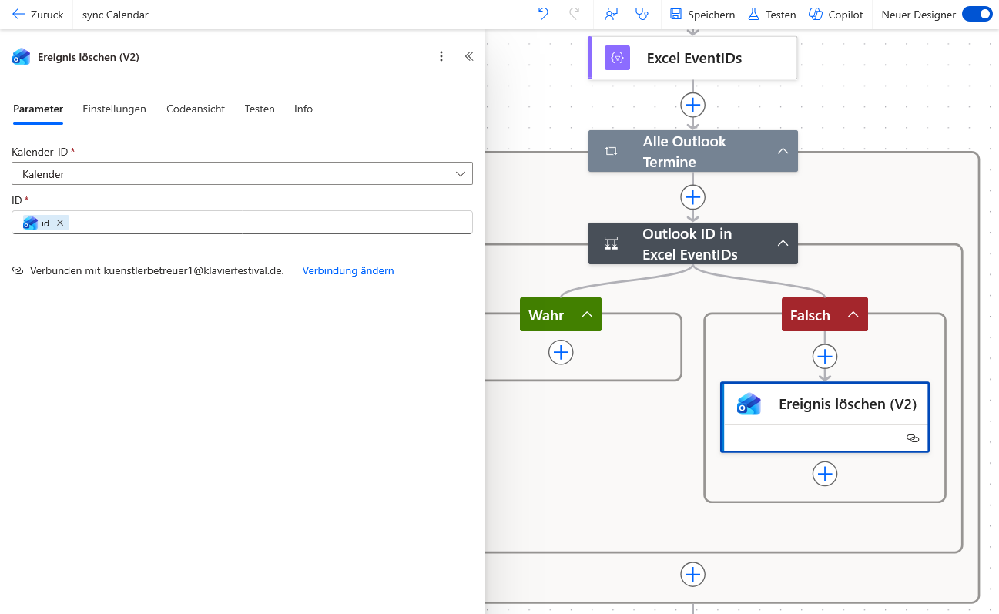

### 8. Select (*Outlook IDs*)
*(Data Operation)*

- From: `outputs('Get_events_(V4)_1')?['body/value']` (output of step 7)
- Switch Map to text mode
- Map: `item()?['ID']`

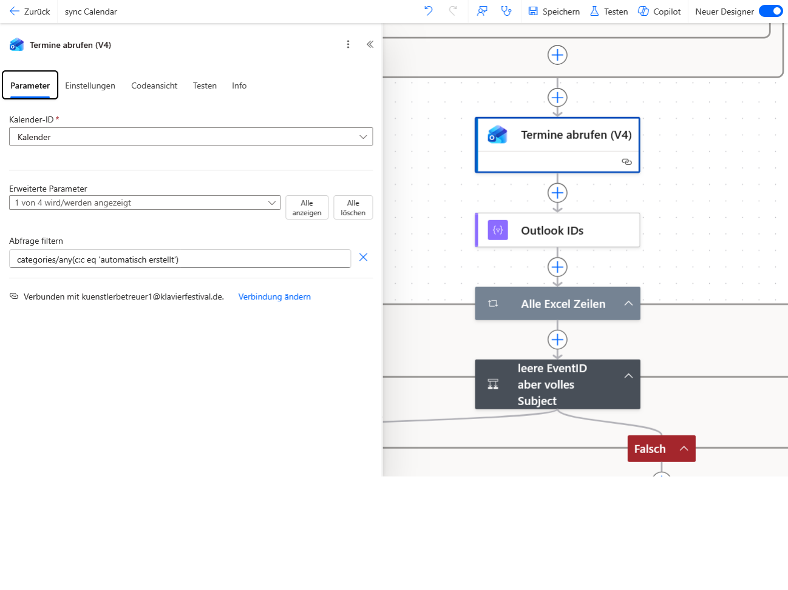

### 9. Apply to each (*All Excel rows*)
*(Control)*

- Output: `outputs('List_rows_present_in_a_table')?['body/value']` (output of step 2)

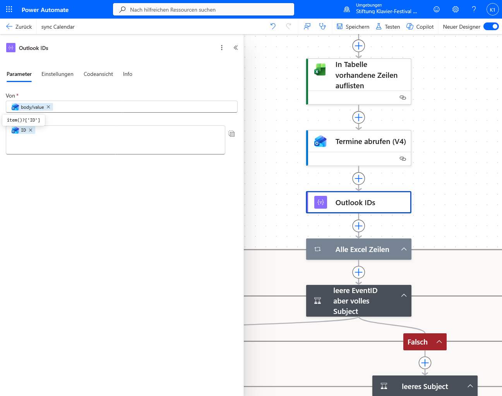

### 10. Condition (*empty EventID but full Subject*)
**Path:** All Excel rows

- And:
  - `empty(items('All_Excel_rows')?['EventID'])` is equal to `true` (EventID from the current item of the loop from step 9)
  - `empty(items('All_Excel_rows')?['Subject'])` is equal to `false` (Subject from the current item of the loop from step 9)

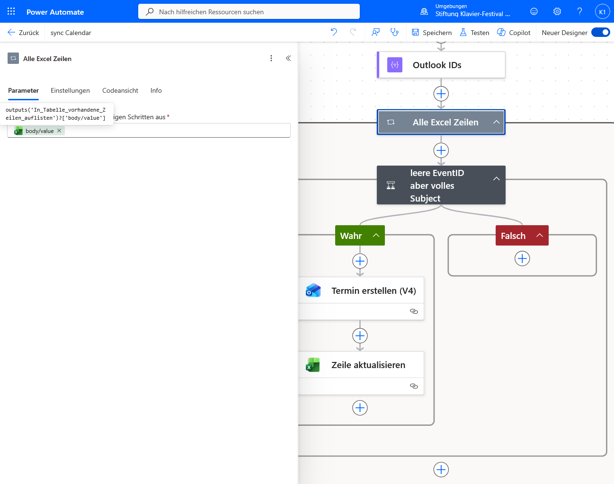

### 11. Create event (V4)
**Path:** All Excel rows › empty EventID but full Subject › Yes

*(Office 365 Outlook)*

- Calendar ID: `Calendar`
- Assign Subject, Start time, and End time each to a column from `items('All_Excel_rows')` (item of the loop from step 9), e.g. `items('All_Excel_rows')?['StartDateTime']`
- Select Time Zone
- Advanced options > Categories > Categories Item - 1: `automatically created` (the category chosen in step 1)
- Optional parameters (from Advanced options):
  - Required Attendees
  - Body (this later appears in the event description; it can come from its own Excel column or be assembled from several dynamic content values, e.g. location, relevant links, etc.)

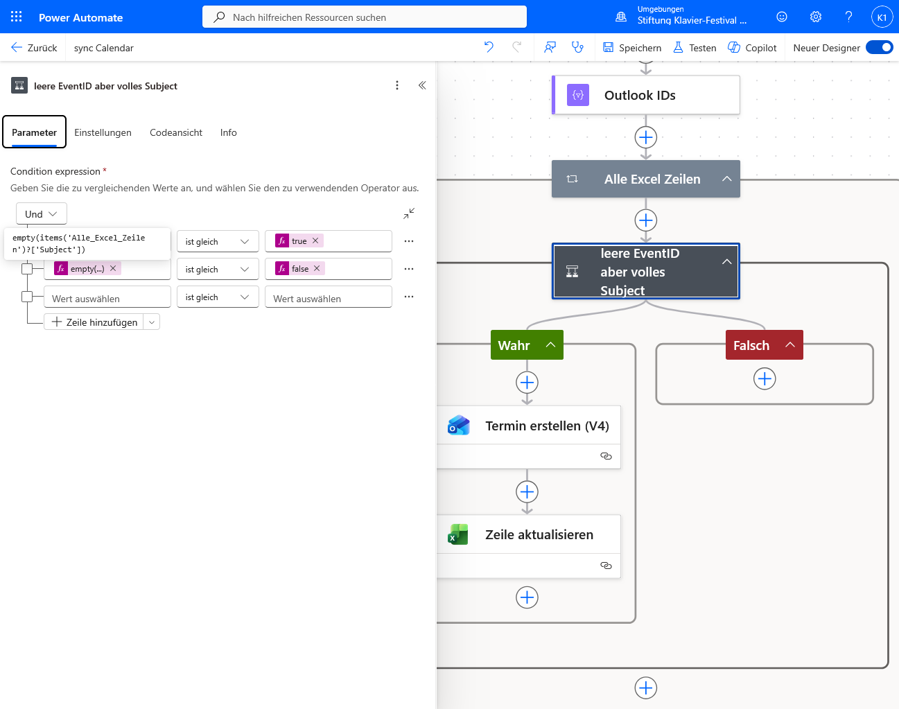

### 12. Update a row
**Path:** All Excel rows › empty EventID but full Subject › Yes

*(Excel Online (Business))*

- Specify the Excel file and table (data _must_ be stored in a table)
- Key column: Index
- Key value: `items('All_Excel_rows')?['Index']`
- Advanced options > EventID: `outputs('Create_event_(V4)')?['body/id']`

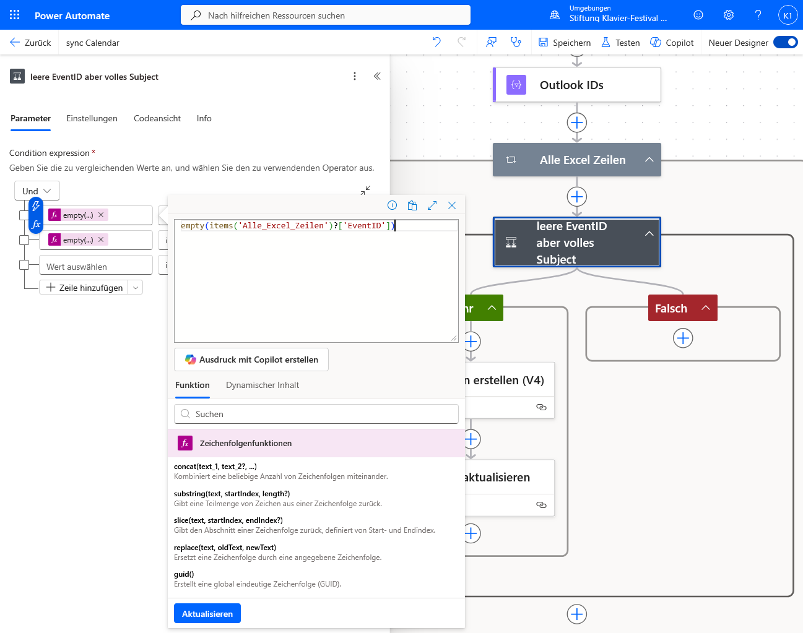

### 13. Condition (*empty Subject*)
**Path:** All Excel rows › empty EventID but full Subject › No

*(Excel Online (Business))*

- And:
  - `empty(items('All_Excel_rows')?['Subject'])` is equal to `true`

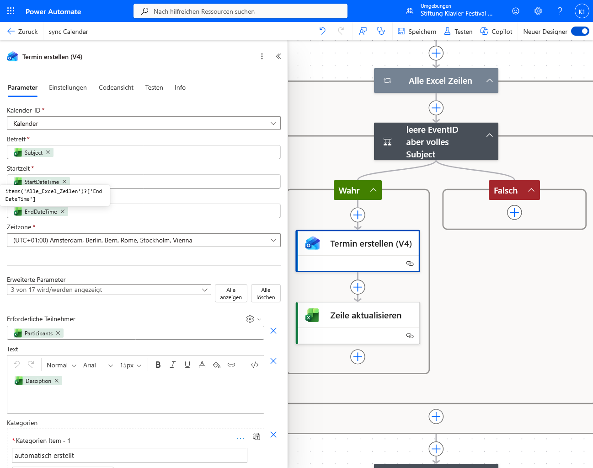

### 14. Condition (*EventID in Outlook IDs*)
**Path:** All Excel rows › empty EventID but full Subject › No › empty Subject › No

*(Excel Online (Business))*

- And:
  - `body('Outlook_IDs')` contains `items('All_Excel_rows')?['EventID']`

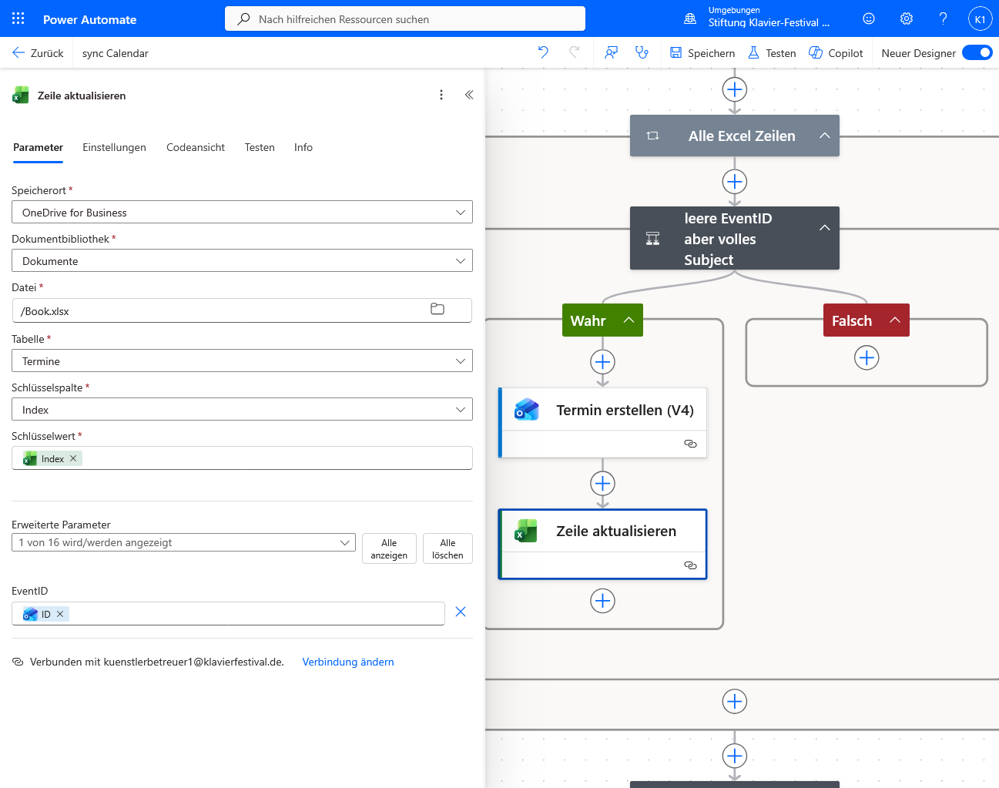

### 15. Update event (V4)
**Path:** All Excel rows › empty EventID but full Subject › No › empty Subject › No › EventID in Outlook IDs › Yes

*(Office 365 Outlook)*

- Calendar ID: `Calendar`
- Assign ID, Subject, Start time, and End time each to a column from `items('All_Excel_rows')` (as in step 11)
- Select Time Zone
- Advanced options > Categories > Categories Item - 1: `automatically created`
- Optional parameters (from Advanced options): see step 11

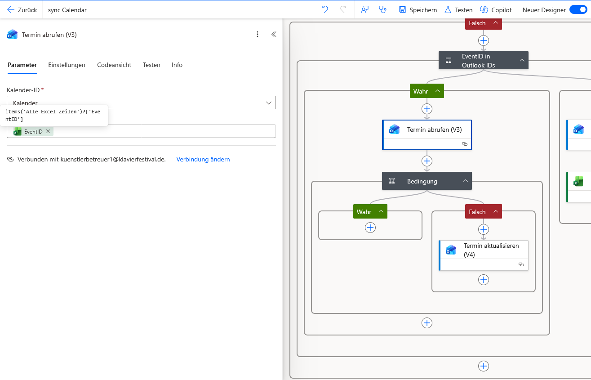

### 16. Create event (V4) (*Create event (V4) 1*)
**Path:** All Excel rows › empty EventID but full Subject › No › empty Subject › No › EventID in Outlook IDs › No

*(Office 365 Outlook)*

*(same as steps 11 & 15)*

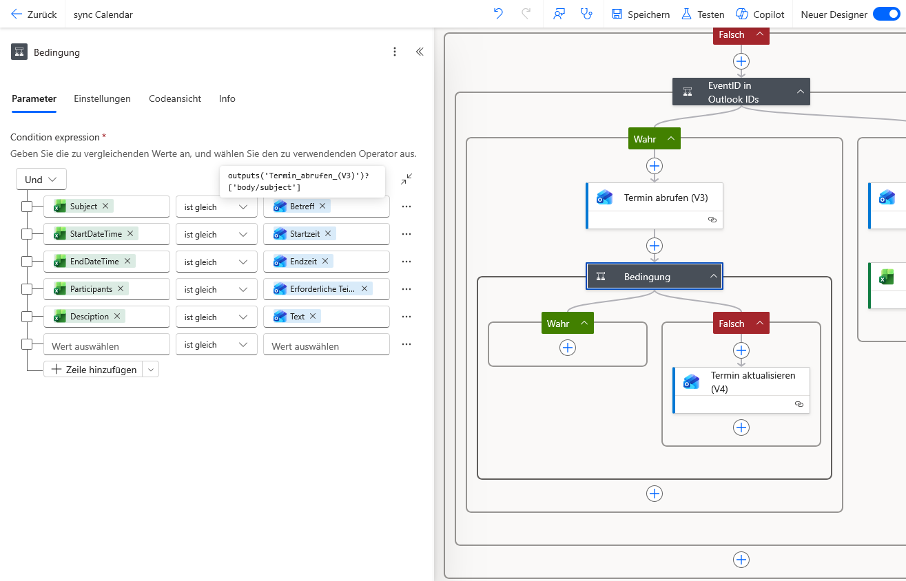

### 17. Update a row (*Update a row 1*)
**Path:** All Excel rows › empty EventID but full Subject › No › empty Subject › No › EventID in Outlook IDs › No

*(Excel Online (Business))*

- Specify the Excel file and table (data _must_ be stored in a table)
- Key column: Index
- Key value: `items('All_Excel_rows')?['Index']`
- Advanced options > EventID: `outputs('Create_event_(V4)_1')?['body/id']`

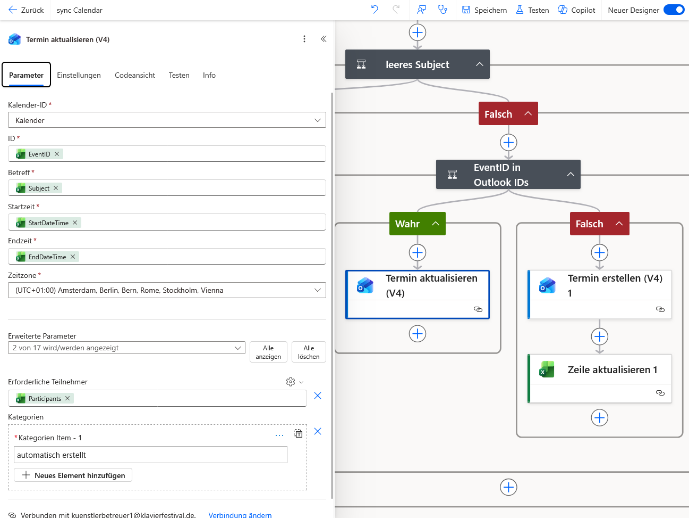
